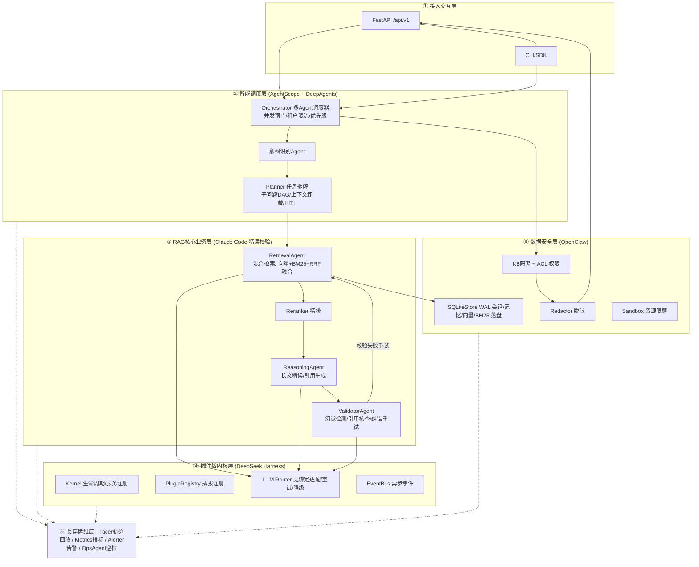
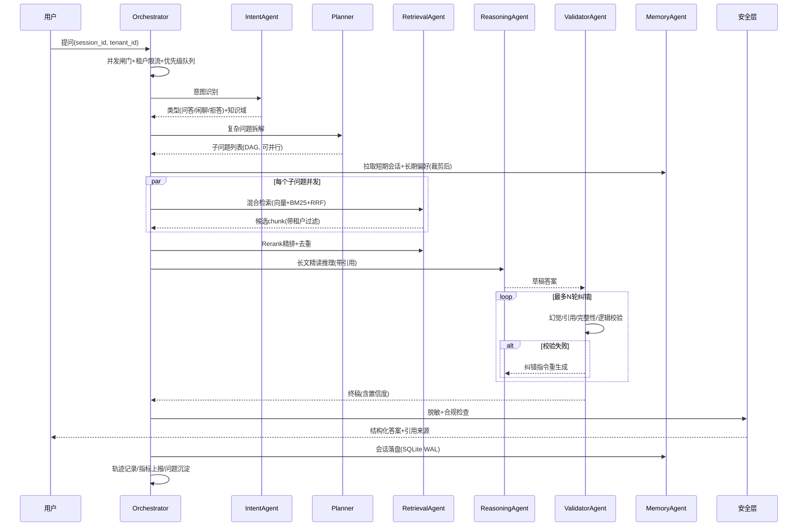

# Fusion-RAG-Agent 设计文档

> 融合 AgentScope / DeepSeek-Harness / DeepAgents / OpenClaw(claw-code) / Claude-Code(hermes 同类) 五大框架优势的
> **插件化、多智能体协作、长上下文、高精准、隐私可控** 企业级 RAG 知识问答智能体框架。

---

## 一、五大框架优势萃取与本项目落点

| 来源框架 | 萃取的核心能力（已在本地源码验证） | 本项目落点 |
|---|---|---|
| AgentScope | `KnowledgeBase` 运行时句柄；`metadata_filter` 多租户纵深隔离；多查询批量嵌入 + `asyncio.gather` 并发检索；`(doc_id, chunk_index)` 去重合并 | `retrieval/`、`security/access_control.py` |
| DeepSeek-Harness | packages 化微内核（core/llm/session/compaction/sandbox/skill/hooks 独立包）；模型无绑定；轨迹记录 | `core/kernel.py`、`core/plugin.py`、`llm/`、`observability/tracer.py` |
| DeepAgents | 中间件栈：planning(todo)、subagent 委派、summarization 上下文压缩、HITL 人工介入、权限校验 | `planning/`、`agents/orchestrator.py` |
| OpenClaw / claw-code | 本地化会话落盘、持久化会话单元、技能/插件目录、审批与权限 | `storage/`、`security/sandbox.py` |
| Claude-Code / hermes | SQLite WAL（并发读 + 单写）、读连接池、FTS5 全文检索、会话压缩链、深度校验循环、**运行时自主 function-calling 工具循环 + PathJail 路径约束 + Skills 渐进式披露** | `storage/sqlite_store.py`、`retrieval/bm25.py`、`agents/validator.py`、`agents/tool_agent.py`、`tools/`、`skills/` |

---

## 二、总体架构（五层 + 贯穿运维）



### 端到端总体流程图



---

## 三、八大核心模块设计

### 3.1 微内核插件底座（core/）
- **PluginRegistry**：能力按 `(kind, name)` 注册（llm/embedding/vector_store/retriever/reranker/session_store/memory/security/tracer/metrics），`entry_point` 式延迟加载，支持版本与替换，运行时插拔无需改内核。
- **Kernel**：服务容器 + 生命周期（`start/stop` 异步上下文），统一优雅关闭（flush 存储、停事件总线）。
- **EventBus**：进程内异步 pub/sub，模块解耦（问答完成事件 → 指标/沉淀/告警订阅者）。
- **Sandbox**：CPU 密集（嵌入/BM25）走 `ThreadPoolExecutor` 隔离；每租户并发信号量 + 令牌桶限流；请求超时护栏。

### 3.2 智能任务规划与拆解（planning/）
- **TaskDecomposer**：LLM 语义拆解复杂问题为子问题 DAG（JSON 结构化输出，带 schema 校验与降级：LLM 失败 → 启发式按连接词拆分 → 单任务直通）。
- **ContextOffloader**：超过 token 预算时将历史轮次卸载为摘要（借鉴 deepagents summarization 中间件 + hermes 压缩链），大检索结果落盘引用而非塞入上下文。
- **HITL**：高风险意图（`risk=high`）挂起等待人工审批（可插拔审批回调，默认自动放行并记录）。
- **优先级**：`normal/professional/urgent` 三级，urgent 抢占信号量配额。

### 3.3 多智能体协作调度（agents/）
六个角色 Agent，统一 `BaseAgent`（名称/职责/`arun` 协议/轨迹埋点）：
- **IntentAgent**：意图+知识域+风险级识别，过滤无效提问（LLM 失败降级为规则分类器）。
- **RetrievalAgent**：调度混合检索器，输出带元数据的候选知识。
- **ReasoningAgent**：长文精读、跨子问题证据串联、带 `[n]` 引用的答案生成、结构化输出（段落/列表/表格自适应）。
- **ValidatorAgent**：四维校验（引用忠实性/完整性/逻辑一致/幻觉），失败产出纠错指令回炉，最多 `max_retry` 轮。
- **MemoryAgent**：短期会话（滑动窗口+摘要）+ 长期记忆（高频问题/偏好，落盘）。
- **OpsAgent**：周期巡检插件健康、指标快照、异常告警。
- **Orchestrator**：全局并发信号量、每租户令牌桶、`asyncio.gather` 并行子问题、失败隔离（单子问题失败不拖垮整体）。

### 3.4 高精度 RAG 检索与推理（retrieval/ + chunking/）
- **Chunker**：近似 token 分块 + 重叠窗口 + 标题路径保留（借鉴 agentscope `_approx_token_chunker`）。
- **Embedding**：插件化——`HashEmbedding`（零依赖离线兜底，确定性哈希向量）/ `OpenAIEmbedding`（兼容 DeepSeek/通义/本地 vLLM）/ `SentenceTransformerEmbedding`。
- **VectorStore**：`LocalVectorStore`（JSONL 落盘 + 内存 numpy/纯 Python 余弦检索，写时异步锁）；接口对齐 agentscope `VectorStoreBase`，可换 Milvus/Qdrant/Chroma。
- **BM25**：纯 Python 实现 + **CJK bigram 分词**（借鉴 hermes FTS5 CJK），中文无第三方依赖即可关键词检索。
- **HybridRetriever**：向量 + BM25 双路并发召回 → **RRF（倒数排名融合）** → 可选 LLM/Cross-Encoder Reranker 精排 → `(doc_id, chunk_index)` 去重。

### 3.5 隐私安全与本地化管控（security/）
- **本地全留存**：向量、会话、轨迹、指标全部落 `~/.fusion_rag/`（可配），无任何强制云端上传。
- **KB 隔离 + ACL**：借鉴 agentscope `metadata_filter` —— 每条 chunk 强制写入 `tenant_id/kb_id`，检索时永远带过滤；插入时过滤键最高优先级覆盖，防越权注入。ACL 表控制 `tenant → kb` 可见性。
- **Redactor**：正则库脱敏（手机号/身份证/邮箱/银行卡/API Key），入库前与输出前双向脱敏。
- **Sandbox 限额**：单请求 token 上限、检索条数上限、执行超时。

### 3.6 多轮记忆与会话管理（memory/ + storage/）
- **SQLiteStore**：WAL 模式（并发读 + 单写），写操作经单 writer 协程串行化，读走 `ThreadPoolExecutor` 连接池 —— 完整借鉴 hermes `hermes_state` 的生产实践。
- 表：`sessions / messages / long_term_memory / documents / chunks_meta / traces / metrics / qa_feedback`。
- **分层记忆**：短期 = 最近 K 轮原文 + 更早轮次滚动摘要；长期 = 高频问题、用户偏好、纠错沉淀。
- **上下文智能裁剪**：按 token 预算「系统提示 > 当前问题 > 检索证据 > 近期对话 > 长期记忆 > 历史摘要」优先级装配。
- **可迁移**：`SessionStore` 为抽象接口，Windows 落盘 SQLite，后续实现 Redis 版仅需新增插件注册。

### 3.7 知识更新与迭代（knowledge/）
- **增量索引**：文档按内容 hash 判重，新增/修改只重嵌入变化 chunk，删除按 `document_id` 整体清除（对齐 agentscope `insert_document/delete_document` 语义）。
- **问题沉淀**：问答完成事件 → 高频问题统计、低分答案入库 `qa_feedback`，供检索权重与提示词迭代。
- **插件迭代**：指标快照落盘，OpsAgent 输出调参建议（top_k、阈值、重试轮数）。

### 3.8 可观测运维（observability/）
- **Tracer**：`contextvars` 传播 trace_id，每次问答生成 span 树（意图/拆解/检索/推理/校验/脱敏），JSONL 落盘，支持按 trace_id 全链路**轨迹回放**。
- **Metrics**：Counter/Histogram/Gauge 轻量注册表（无 Prometheus 依赖，暴露 `/metrics` 文本格式），统计 QPS、P95 延迟、校验通过率、检索命中率。
- **Alerter**：阈值规则（错误率/延迟/插件失联）→ 日志告警 + 事件总线广播（可挂钉钉/webhook 插件）。
- **结构化日志**：JSON lines，trace_id 自动注入（借鉴 AgentScope Java traceId 传播）。

### 3.9 运行时 Agentic 文件工具（tools/ + agents/tool_agent.py）

对标 **Claude Code / hermes harness**：让大模型在问答**运行时**通过 OpenAI 原生
function-calling **自主多轮调用只读文件工具**，在授权目录内探查原始知识库，读取比
向量片段更充分、可核对的原文证据，并给出 `文件名:行号` 引用。纯标准库（`re`/`pathlib`/`os`），
零新增强依赖。

- **协议层扩展（llm/base.py）**：`Message` 增 `tool_calls/tool_call_id` 与 `tool_result` 工厂；
  新增 `ToolCall` 与 `parse_tool_calls`（容错解析 arguments 的 JSON）；`LLMResponse.tool_calls`
  + `wants_tools`；`LLMBase.supports_tools` 能力位。`LLMRouter.supports_tools()` 门控，向不支持
  tools 的 provider 自动剔除 `tools/tool_choice`（离线 `EchoLLM` 即此路径）。
- **工具集（tools/file_tools.py）**：`grep`（正则/字面量全文检索，支持 `context` 前后文行与
  `skip`/`next_cursor` 分页游标）、`glob`（模式定位）、`find`（按名称/大小/修改时间/类型筛选并排序）、
  `list_dir`（列目录）、`read_file`（带行号分页精读）；均为 `Tool` 子类，暴露 OpenAI JSON Schema。
  搜索类工具经 `PathJail.search_bases` **跨多个授权 root 合并检索**（同一相对子目录在各 root 下都探测）。
- **PathJail 纵深防御（tools/path_jail.py）**：所有路径先归一化，拦截 `..` 穿越 / 绝对越界 /
  软链逃逸 / 设备文件（`/dev`、`\\.\`、`nul` 等），越权抛 `AccessDeniedError`（执行器转为错误结果回填）。
- **执行器（tools/executor.py）**：`ToolRegistry` 按名调度；阻塞 IO 经 `_offload` 投递到 `CpuExecutor`
  线程池；单调用 `asyncio.wait_for` 超时。**刻意不复用 `sandbox.run_guarded`**——工具调用发生在已被
  Orchestrator `run_guarded` 包裹的请求内，嵌套取全局并发信号量会在满载时死锁。
- **ToolAgent 循环（agents/tool_agent.py）**：`chat(tools=..., tool_choice="auto")` → 请求工具则执行并
  以 `tool` 角色回填、继续；直接作答则收敛；达 `max_iters` 去工具强制收尾（标记 `degraded`）；
  `_CITE_RE` 从输出抽取 `文件:行号` 引用。任一异常均降级，绝不抛断主链路。
- **编排集成（Orchestrator step 5.5，非破坏）**：仅当 `agentic_tools` 开 + 首选 provider
  `supports_tools` + 证据缺失或置信度 < `agentic_confidence_threshold` 时触发；`_maybe_agentic` 用读到的
  原文替换答案、`_build_file_citations` 按 basename 回链到已检索 `document_id`；异常回退原答案，
  结果记入 `meta["agentic"]`。**离线 EchoLLM 完全跳过，现有行为与测试不变。**

### 3.10 Skills 渐进式披露（skills/）

借鉴 **Anthropic Agent Skills**（deepagents `middleware/skills.py`）与 **hermes** `skill_preprocessing`：
一个 skill = 一个含 YAML frontmatter 的 `SKILL.md` 目录（`name`/`description`/`allowed-tools`/`metadata` + 正文
流程），是教模型「**怎么做某类任务**」的知识/流程，与可被 function-calling 调用的**工具**互补。

- **零硬依赖解析（skills/frontmatter.py）**：优先 PyYAML，未安装时退化到内置容错解析器（`key: value` 标量、
  折叠/字面块、行内列表、一层嵌套映射）；`normalize_allowed_tools` 兼容 list/逗号/空格分隔。
- **数据模型（skills/base.py）**：`Skill` 数据类 + Agent Skills 规范名称校验（小写字母/数字/连字符，≤64；
  description ≤1024）；`render_body` 做 `${SKILL_DIR}`/`${SESSION_ID}`/`${TENANT_ID}` 模板替换（无值原样保留）。
- **分层加载（skills/loader.py）**：`scan_layer` 扫描一个根目录下含 `SKILL.md` 的子目录；`load_skills`
  按 `base→user→project` 有序合并，**后层同名覆盖前层**，非法/缺 description 的跳过并告警。
- **渐进披露（skills/registry.py）**：`SkillRegistry` 只把 `name + description + 读取路径`（形如
  `<skill>/SKILL.md`）渲染进 ToolAgent system prompt（省 token）；模型判断任务匹配后用**已有的 `read_file`**
  按需读全文再照其执行。`roots()` 供上层把技能目录并入 jail。
- **集成（agents/tool_agent.py + bootstrap.py）**：`ToolAgent` 新增可选 `skill_registry`，将技能清单注入
  system prompt、技能层级根**自动并入** `ToolContext.roots`；为此 `PathJail.resolve_first_existing` 让
  `read_file` **跨所有 root** 解析相对路径（与搜索类工具一致）。`bootstrap._build_skill_registry` 按 `skills.dirs`
  构建并注入。**未配 `skills.dirs` 或离线 EchoLLM 时完全不参与，行为与测试不变。**

---

## 四、高并发与生产级设计要点

| 关注点 | 方案 |
|---|---|
| 并发模型 | 全链路 asyncio；CPU 密集（嵌入/BM25/余弦）走线程池，避免阻塞事件循环 |
| 写竞争 | SQLite 单 writer 协程 + WAL；向量库 asyncio.Lock + 定期 flush |
| 过载保护 | 全局信号量（max_concurrent_requests）+ 每租户令牌桶限流 + 请求级超时 |
| 失败韧性 | LLM Router 多模型重试/降级链；每个 Agent 均有无 LLM 的确定性降级路径 |
| 优雅关闭 | Kernel lifespan 统一 stop：flush 存储、取消后台任务、关闭连接池 |
| 零强依赖 | 核心路径纯标准库 + aiohttp/FastAPI 可选；离线可跑（HashEmbedding + EchoLLM），生产换真实模型插件 |
| 配置 | Pydantic Settings 分层：默认 → yaml → 环境变量，租户/KB 声明式配置 |

## 五、目录结构

```
fusion-rag-agent/
├── DESIGN.md / README.md / pyproject.toml / config.example.yaml
├── fusion_rag/
│   ├── core/        # 微内核: config logging exceptions events plugin kernel sandbox
│   ├── llm/         # 模型无绑定: base openai_compatible ollama echo router
│   ├── embedding/   # base hash openai sentence_transformers
│   ├── chunking/    # token chunker
│   ├── retrieval/   # base vector_store local_store bm25 hybrid reranker
│   ├── storage/     # sqlite_store(WAL)
│   ├── memory/      # short_term long_term manager
│   ├── security/    # access_control redaction sandbox
│   ├── planning/    # decomposer context_offload
│   ├── agents/      # base intent retrieval reasoning validator memory ops tool_agent orchestrator
│   ├── tools/       # base path_jail file_tools(grep·glob·find·list_dir·read_file) registry executor
│   ├── skills/      # base(模型/校验) frontmatter(YAML解析) loader(分层扫描) registry(渐进披露)
│   ├── rag/         # pipeline(检索→精排→推理→校验闭环)
│   ├── knowledge/   # indexer(增量) feedback(沉淀)
│   ├── observability/ # tracer metrics alerter
│   └── api/         # FastAPI app schemas
├── examples/        # ingest / ask / replay / concurrent_bench
└── tests/           # 端到端 + 各模块单测
```
